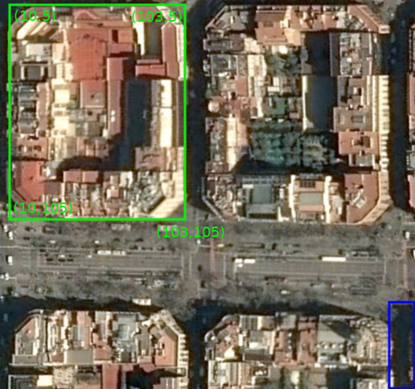

# Introduction

OneAtlas Playground is a cloud environment to process satellite images. If you wish to run your algorithm in OneAtlas Playground, you need to implement a specific API, and provide us with information about your implementation.

# Information Needed

Please provide us with the following information so we can hook up your service. Note that this step is not automatic, but the result of a person-to-person interaction and a manual intervention.

* **Resolution:** The resolution at which you wish to receive imagery data, in meters-per-pixel. Example: 0.5 meters/pixel.

* **Image Padding:** If you are unable to operate in the image borders, provide the number of pixels where this happens. We only support services that require at the most 256 pixels of padding.

* **Image Size:** The width and height of a single image unit to process. Example: 256x256 or 1024x1024. Do not include eventual needed padding here; for example, if you request a 256x256 image with 10 pixels of padding, your endpoint will be receiving requests for images that are 276x276.

* **HTTP endpoints:** URLs where we can access the healthcheck and processing endpoints (see paragraphs below for detailed description). These should be either in the form of ```http://localhost:port/path``` if you are providing a docker service, or a fully compliant ssl endpoint of the form ```https://myserver.tld/path/to/processing``` if you are hosting yourself.

* **Concurrency:** How many requests you are able to process concurrently if you are hosting yourself.

* **Processing Duration Estimation:** An estimate of how many seconds of processing are needed for a single image unit.


# Endpoint Descriptions

Wether you are hosting the service yourself or providing a docker image implementing the service, you will need to implement two endpoints:

## Healthcheck endpoint

This endpoint should return an http 200 OK on GET requests once the service is ready to accept incoming processing requests. If this endpoint cannot be reached or does not return a 200 OK , the service will be considered as unhealthy and will not receive requests to process. Typically, if the service needs time to initialize at startup, the healthcheck endpoint should return a non-200 code until the initialization is over and requests can actually be served.

## Processing endpoint

This endpoint should accept POST requests and will receive requests containing an base64 encoded image payload embedded in a JSON document. The image you will receive will respect the specifications asked by your process, namely size and resolution. The payloads received by this endpoint are fixed and cannot be extended, if you require additional information this should be set in the URL (e.g.: ```https://service.tld/process?api_key=foo&version=1.0```)

### Detection/Segmentation Payloads

```json
{
	"resolution": 0.5,
	"tileFormat": "image/jpeg",
	"tile": "base64encodedimagedata"
}
```

### Change-Detection Payloads

```json
{
	"resolution": 0.5,
	"tile1Format": "image/jpeg",
	"tile1": "base64encodedimagedatafortile1",
	"tile2Format": "image/jpeg",
	"tile2": "base64encodedimagedatafortile2"
}
```

# Expected Output

## Successful Output

A successful result MUST be returned with a 200 OK.

The output body follows the principles of [GeoJSON](https://en.wikipedia.org/wiki/GeoJSON), it must comply with the following characteristics :

* Root element MUST be a 'FeatureCollection' with one or several 'Feature' objects. Currently only Polygon, Multipolygon, and Point features are supported.
* Geometries MUST be topologically correct (i.e. no degeneracies or self-intersections)
* Geometry coordinates are given in pixel space, with (0,0) at the top left of the image. If you have requested padding, features that intersect the padding area will **not** be discarded on our end.
* Feature properties MAY include 'category' and 'confidence'.
    * The 'category' property is used for tags, labels or classification results. Its value MUST be an array of strings.
    * The 'confidence' property value MUST be a float between 0.0 and 1.0.

**Feature geometry example :**



* service requested an image of 256x256 with a padding of 5
* the input image is 266x266
* the detected change drawn in green does not overlap the padding area
* the detected change drawn in blue overlaps the padding area

The result in this case would be:

```json
{
	"type":"FeatureCollection",
	"features": [
		{
			"type":"Feature",
			"properties": {"category":["building"]},
			"geometry": {
				"type": "Polygon",
				"coordinates": [[[10,5],[10,105],[103,105],[103,5],[10,5]]]
			}
		},
		{
			"type":"Feature",
			"properties": {"category":["road"]},
			"geometry": {
				"type": "Polygon",
				"coordinates": [[[240,220],[240,266],[266,266],[266,220],[240,220]]]
			}
		}
	]
}

```

## Unsuccessful Output

The service should return a body of the following format if it wishes to inform of a permanent processing error for the current image:

```json
{
	"message":"a goblin ate my GPU!",
	"hint":"(optional) message to prevent this error from happening again"
}
```

If the service is unable to produce a result or a correctly formatted error, the 408, 423, 429, 500, 502, 503 and 504 HTTP
return codes will be interpreted as transient errors and will be retried in a later subsequent request. All other HTTP
status codes will be interpreted as permanent.
