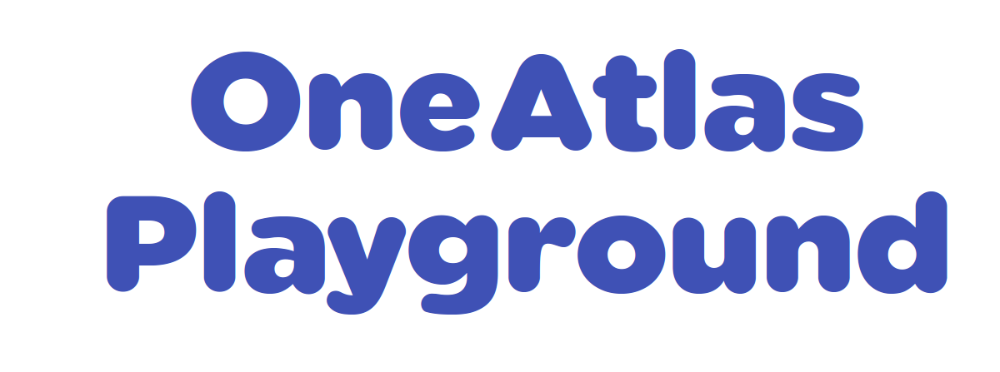

An Open Platform to Create New Innovative Services from Satellite Imagery.

For more informations, go to the [official website](https://sandbox.intelligence-airbusds.com/web/).

You will find here documentation regarding:

* Using the OneAtlas Playground Web Interface
* Deploying services on OneAtlas Playground

# Introduction

The OneAtlas Playground is the sandbox development platform for imagery services based on OneAtlas.

# Core Concepts

The core principle of OneAtlas Playground is to provide a "sandboxed" environment connected to OneAtlas Imagery in order to develop, deploy and test Machine Learning services in a Cloud Environment.
It relies on the Google Cloud Platform components.

The main objective of the Playground is to abstract away data connection, deployment and scalability for any Data Scientist and to provide an integrated platform to directly assess the performance and scalability of ML services.

# Sandboxed Deployment

Abstracting away the deployment of ML services is done by deploying Docker containers on Google Kubernetes Engine or others cloud providers.

# Tagging and Labelling

The Playground also offers a Web Interface to create, edit and refine datasets using OneAtlas images via tagging, detouring and markin Area Of Interests, Region Of Interests and objects on satellite images.

