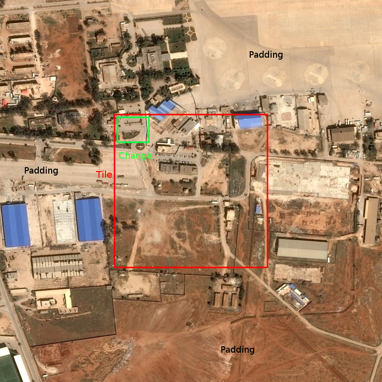

# Introduction

OneAtlas Playground allows to process tile images in order to detect objects, changes ...

# Web-Service API

The process has to provide a REST web-service that implements the [Geo Process API](https://airbusgeo.github.io/geoapi-viewer/?url=https://raw.githubusercontent.com/airbusgeo/playground-docs/master/api/api_geo_process_v1.0.0.yaml).

In the Playground, processes are asynchronous, the synchronous interface of the API is not used.
The following services must be implemented.

**GET /api/v1/openapi**

This service returns the OpenAPI specification of the Geo Process API in YAML format.

**GET /api/v1/describe**

This service provides generic process informations to the Playground.

* padding : tile padding / border (0 to 256)
* nb_tiles : number of tiles for each processing (1 or 2)

**GET /config**

This service provides specific informations to the Playground.

**POST /jobs**

This service executes the process on input data described by the input property of the describe service ans returns the result in the format defined by the output property of the describe service.

# Templates

Playground defines several templates for the describe service.
They have to be used by custom processes in order to be integrated to the Playground.

Templates are defined for each kind of process that are supported by the Playgroud:

* object detection
* change detection

# Input

Tiles are 8 bits RGB images of 256x256 pixels (without padding).
They are base64 encoded in a JSON document passed as the request body.

# Output

When process output is defined as [GeoJSON](https://en.wikipedia.org/wiki/GeoJSON), it must comply with the following characteristics :

* Root element has to be a 'FeatureCollection' with one or several 'Feature' objects.
* Feature geometry is expressed with (0,0) at the top left of the tile image padding included.
* Feature properties may be 'category' and 'confidence'.
    * The 'category' property is used for tags, labels or classification results. It's value may be a string with several values separated by a comma or an array of strings.
    * The 'confidence' property value is a float between 0. and 1.0.

**Feature geometry example :**

* tile of 100x100 in red with a padding of 100
* the input tile image is 300x300
* the detected change in green of 20x15

The result is `[[100, 100], [120, 100], [120, 115], [100, 115]]`

